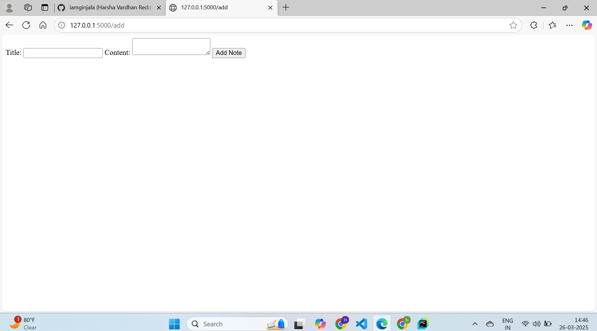
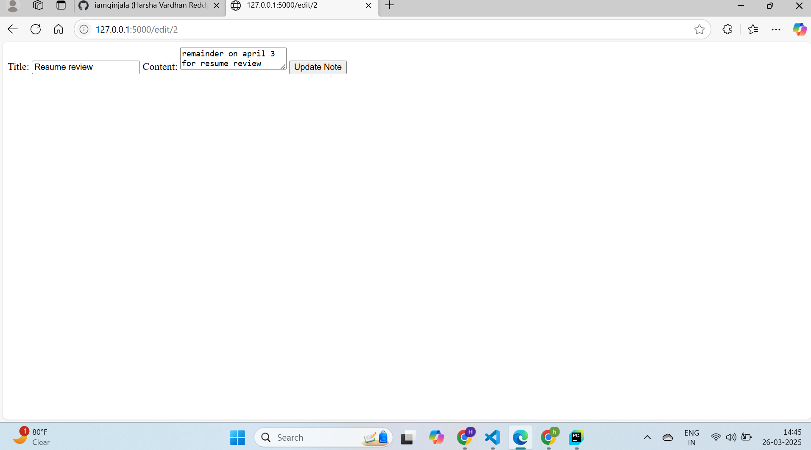
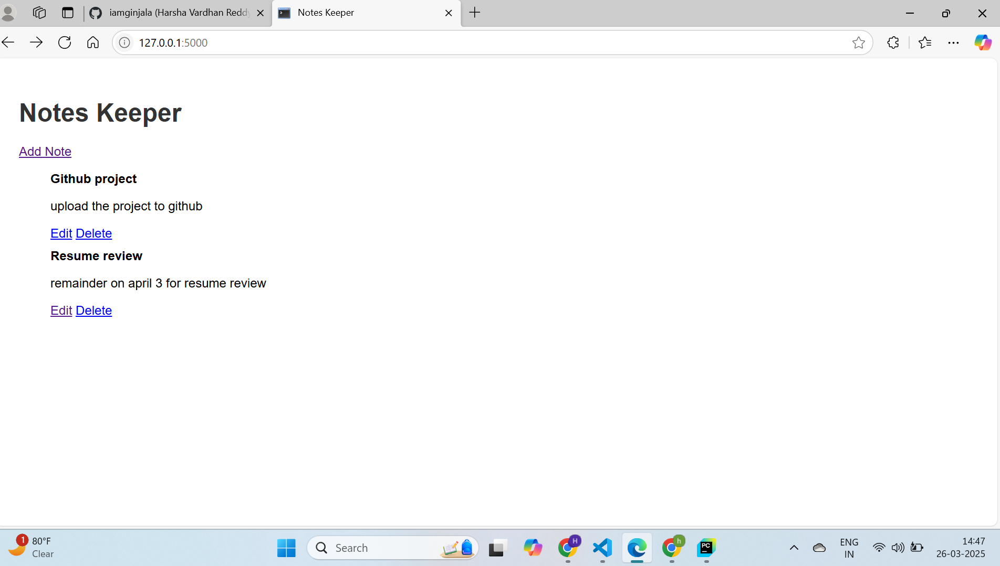

## 📝 Project: Notes Keeper App (Flask + SQLite)

A basic web app that lets users create, view, edit, and delete notes.

## 📌 Features

✔ Add new notes

✔ View all saved notes

✔ Edit existing notes

✔ Delete notes

✔ Uses Flask & SQLite

## Project Structure

NotesKeeper/

│── static/

    styles.css        # CSS for styling

│── templates/

    index.html        # Homepage (list all notes)
   
    add_note.html     # Add a new note
   
    edit_note.html    # Edit an existing note

│── database/
   
    notes.db          # SQLite database

│── app.py                # Flask application

│── models.py             # Database models

│── requirements.txt      # Python dependencies

## How to Run the Project

1️.  Clone the Repository

git clone https://github.com/iamginjala/NotesKeeper.git
cd NotesKeeper

2. Create Virtual Environment

python -m venv venv
source venv/bin/activate  # On Windows, use `venv\Scripts\activate`

3. Install Dependencies
pip install -r requirements.txt

4. Run the App
python app.py

## sample output

