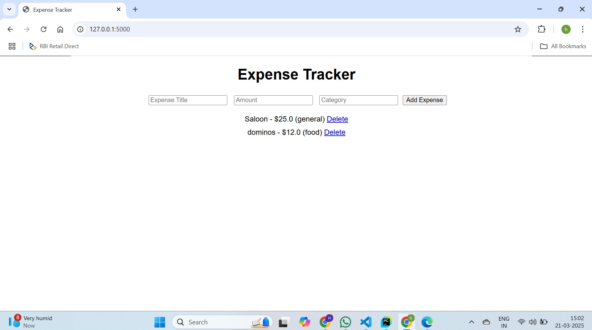

# Personal Expense Tracker

A simple web-based expense tracker built using Flask.

## Features
- Add and delete expenses
- Categorize expenses
- Store expenses in a SQLite database

## Setup
1. Install dependencies:
   ```sh
   pip install -r requirements.txt
2. Run the application:
    python app.py
3. Open your browser and go to http://127.0.0.1:5000/.

## sample output 




## Future Enhancements

User authentication
Data visualization (graphs/charts)
Monthly expense reports

