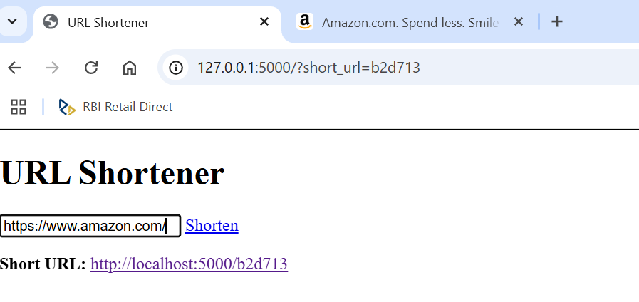

# Flask URL Shortener

A simple URL shortener built with **Flask** and **Redis** that allows users to shorten long URLs and redirect to the original website using a shortened link.

## Features
- Shorten long URLs to a unique short URL
- Store mappings between long and short URLs in Redis
- Automatically redirect to the original URL when accessing the short link
- Simple HTML interface for user interaction
- Uses **MD5 hashing** for generating short URLs

## Tech Stack
- **Python** (Flask)
- **Redis** (for storing URL mappings)
- **HTML & CSS** (for frontend)

## Installation & Setup
### 1. Clone the Repository
```bash
git clone https://github.com/yourusername/flask-url-shortener.git
cd flask-url-shortener
```

### 2. Install Dependencies
Create a virtual environment and install required Python packages:
```bash
python -m venv venv
source venv/bin/activate  # On Windows use: venv\Scripts\activate
pip install flask redis
```

### 3. Start Redis Server
Ensure Redis is running on your system. If Redis is installed, start it with:
```bash
redis-server
```

### 4. Run the Flask Application
```bash
python app.py
```
The app will start on `http://localhost:5000/`.

## Usage
1. Enter a long URL in the input field.
2. Click **Shorten**.
3. A short URL (e.g., `http://localhost:5000/abc123`) will be generated.
4. Click the short URL to be redirected to the original website.

## sample output


## API Endpoints
| Method | Endpoint                | Description                     |
|--------|-------------------------|---------------------------------|
| `GET`  | `/`                     | Renders the homepage            |
| `GET`  | `/shorten/<long_url>`   | Generates and stores a short URL |
| `GET`  | `/<short_url>`          | Redirects to the original URL  |

## Project Structure
```
flask-url-shortener/
│-- static/         # CSS/JS files
│-- templates/      # HTML files
│   ├── index.html  # Main page UI
│-- app.py          # Flask application
│-- redis_client.py # Redis database interactions
│-- requirements.txt # Required dependencies
│-- README.md       # Project documentation
```

## Future Improvements
- Implement user authentication for personalized URL shortening
- Track analytics (clicks per short URL)
- Add a custom short URL feature


## Author
Harsha G

